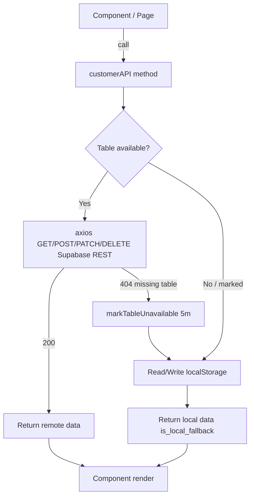

# Presentasi Teknis — BengkelGo (nailay-green-void)

Penjelasan arsitektur & alur sistem, gaya developer-to-developer. Aplikasi ini adalah SPA manajemen bengkel/auto-service center bernama BengkelGo.

## 1. Stack & Tooling
- **Build tool:** Vite 8 (`vite.config.js`), plugin `@vitejs/plugin-react` (HMR) + `@tailwindcss/vite` (Tailwind v4, tanpa PostCSS config).
- **Framework:** React 19.2 — function components + hooks.
- **Routing:** `react-router-dom` v7, deklaratif `<Routes>` di `App.jsx`, dibungkus `BrowserRouter` di `main.jsx`.
- **Styling:** Tailwind CSS v4 (`@import "tailwindcss"`) + DaisyUI v5. Token warna brand di `tailwind.config.js` (`primary #DEE33E`, `secondary #9FA324`).
- **Library pendukung:** `axios` (HTTP ke Supabase), `recharts` (chart), `leaflet` + `react-leaflet` (map), `react-icons` (icon).

## 2. Entry Point & Routing Architecture (`src/App.jsx`)
Semua page di-`lazy()` + `<Suspense fallback={<Loading/>}>` → code-splitting per route (bundle dipecah otomatis Vite). Empat grup route:
- **Public:** `/` → `GuestLanding`.
- **Auth:** `/login`, `/register`, `/forgot` (`AuthLayout`).
- **Member:** `/member-dashboard`, `/member-booking`, `/member-history`, `/member-complaints`, `/member-profile` (`MemberLayout`, guard `["Member"]`).
- **Staff:** `Owner/Kasir/Mekanik` share `MainLayout`, guard `allowedRoles`, sidebar filter menu by role.

## 3. Auth & Role-Based Access Control
- `ProtectedRoute` (`App.jsx:41`) baca `user_session` dari `localStorage`, parse `role`, redirect ke `/login` bila null / silent-redirect ke dashboard sesuai role. **Client-side guard** (bukan pengganti auth server-side).
- Sesi = JSON plain di `localStorage`, dikonsumsi `Sidebar` untuk render menu/nama/tier.

## 4. Data Layer — Service Layer Pattern (`src/services/userAPI.js`)
- Satu modul `customerAPI` ekspos CRUD: members, bookings, complaints, promos → Supabase REST `/rest/v1` (`apikey` publishable + `Authorization: Bearer`).
- **Resilience (circuit-breaker fallback):** tiap tabel punya `isTableUnavailable()`. Bila REST balik 404 (missing table), tabel di-mark unavailable 5 menit (`TABLE_RECHECK_DELAY_MS`), lalu read/write dialihkan ke **localStorage** (`_local_bookings`, `_local_complaints`, `_local_promos`, `_local_members`). App tetap jalan offline / saat tabel belum ada.
- **Merge strategy:** remote Supabase diprioritaskan, localStorage jadi override (`is_local_fallback`). `Promise.all` + `.catch(() => [])` di Dashboard → satu fetch gagal tak menggagalkan seluruh dashboard.
- Schema: `supabase-schema.sql` (`bengkel_users`, `bengkel_bookings`, `bengkel_complaints`, `bengkel_promos`) + index `role`/`member_id`/`code`.

## 5. Alur Data (Supabase ↔ localStorage fallback)

## 6. Component Library / Design System (`src/components`)
Komponen presentasional reusable, props-driven: `Card`, `StatCard`, `Table`, `Button`, `InputField`, `SearchField`, `DatePicker`, `Badge`, `Avatar`, `PageHeader`, `Container`, `Header`, `Footer`, `Loading`, `Sidebar`, `RecentOrderSection`, `ServiceOrderModal`. Konvensi: radius `rounded-[24px]`, warna brand `bg-[#DEE33E]`.

## 7. Domain Features
- **Dashboard:** agregasi stat via `Promise.all` multi-API → `StatCard` + tabel recent bookings.
- **Coverage:** `react-leaflet` `MapContainer` + `TileLayer` CARTO + `Marker` + `Circle` radius 10km (Pekanbaru).
- **ServiceSimulation:** accordion + dropdown penugasan montir (UI, data hardcode).
- **GuestLanding:** SPA landing + rule-based chatbot (quick replies + keyword `booking`/`jadwal`, trigger login), polling promo 30s (`setInterval`).
- **Membership util** (`src/utils/membership.js`): tier discount 5–20%, reward points `floor(price/10000)`, reward history di localStorage.

## 8. Catatan Teknis / Technical Debt
- Auth client-side only (token di localStorage, publishable key ter-expose, tidak ada JWT verify / refresh).
- Fallback localStorage tidak auto-replay ke Supabase → data lokal bisa stale.
- `pertemuan-2/3/4/` = mini-app terpisah (punya `main.jsx` sendiri), tidak ter-route di app utama → artefak tugas, bukan produksi.
- Tanpa TypeScript → tipe mengandalkan runtime (`response.data`).

---

## Flow 1 — Auth (Register → Login → Session)
Actor: calon user (Member/Staff).
- **Register** (`pages/auth/Register.jsx`): form controlled `formData` (fullName, email, password, confirmPassword, role). Validasi client-side `password === confirmPassword`, lalu `customerAPI.registerUser(payload)` → `POST /bengkel_users` (Supabase) dengan default `tier: "Bronze"`, `role` dari select. Handler error baca `err.response.status === 409` / string `"duplicate"` untuk deteksi email unik (kolom `email UNIQUE`). On success → `navigate("/login")`.
- **Login** (`pages/auth/Login.jsx`): `customerAPI.getMemberByEmail(email)` → `GET /bengkel_users?email=eq.<email>`. Validasi password **plaintext equality** (`userData.password !== formData.password`). Jika cocok, simpan seluruh object ke `localStorage["user_session"]` (session object), lalu branch routing by `role`: `Member → /member-dashboard`, `Owner/Kasir/Mekanik → /dashboard`.
- **Guard**: `ProtectedRoute` di `App.jsx` baca `user_session`, redirect kalau null / role tidak masuk `allowedRoles`.

Gambar di kertas: `[Register form] → POST bengkel_users → [Login form] → GET bengkel_users → cocok? → simpan localStorage → route by role`.

## Flow 2 — Produk / Promo (CRUD lifecycle)
Actor: Owner (create/edit/delete), Kasir (read), Member (read konsumsi).
- **Source of truth**: tabel `bengkel_promos` (`kode`, `nama_produk`, `harga`, `diskon`, `exp_date`, `type`, `deskripsi`, `min_purchase`).
- **Read**: `PromoManagement` (`pages/PromoManagement.jsx`) mount → `useEffect → fetchPromos()` → `customerAPI.getAllPromos()` → `GET /produk?order=id.desc`. Di-normalize via `normalizePromo()` lalu di-filter client-side (`useMemo`) by `searchTerm` + `filterType` (All/Kupon/Diskon/Cashback). Halaman `GuestLanding` & `MemberDashboard` juga consume `getAllPromos()` (GuestLanding polling 30s `setInterval`).
- **Create**: modal `handleCreate` → validasi field wajib (`code`, `name`, `discount`) → `customerAPI.createPromo(payload)` → `POST /produk` (fallback localStorage kalau tabel 404). Lalu `fetchPromos()` re-fetch.
- **Update**: `handleUpdate` → `customerAPI.updatePromo(id, payload)` → `PATCH /produk?id=eq.<id>`.
- **Delete**: **hanya Owner** (`canDelete = userRole === "Owner"`), `handleDelete` → `customerAPI.deletePromo(id)` → `DELETE /produk?id=eq.<id>` (confirm `window.confirm`).

Gambar di kertas: `[Owner] → createPromo/updatePromo → bengkel_promos ⟷ getAllPromos → [Kasir/Member view] ; delete hanya Owner`.

## Flow 3 — Order / Booking (lifecycle utama)
Dua sisi: **Member (create)** dan **Staff (manage)**. Tabel: `bengkel_bookings` (`user_id`, `kendaraan`, `jenis_servis`, `tanggal_booking`, `keluhan`, `total_harga`, `diskon_applied`, `status`).

**Sisi Member** (`pages/member/MemberBooking.jsx`):
- Form `formData` (vehicle, service, date, complaint). Katalog harga hardcode `servicePrices` (Ganti Oli 250k … Perbaikan Mesin 650k).
- Ambil `tier` dari `user_session`, hitung `discountRate = getDiscountByTier(tier)` (Bronze 5% … Platinum 20%, dari `utils/membership.js`). `finalPrice = servicePrice − (servicePrice*discount/100)`.
- Submit → `customerAPI.createBooking({ user_id, kendaraan, jenis_servis, tanggal_booking, keluhan, total_harga, diskon_applied, status:"booked" })` → `POST /pesanan`. Status awal `"booked"`.

**Sisi Staff** (`pages/AdminBookingLog.jsx`):
- Mount → `Promise.all([getAllBookings(), getAllMembers().catch(()=>[])])` → bangun `userMap[id]→fullName` untuk join nama pelanggan. `normalizeBooking()` map field DB → view model.
- **State machine status** (`BOOKING_STATUSES`): `booked → pending → in_progress → completed`, plus `cancelled`. Perubahan via `<select>` inline → `handleBookingStatusChange` → `customerAPI.updateBooking(id, {status})` → `PATCH /pesanan`. Optimistic update state lokal.
- **Edit** (Owner & Kasir, `canEdit`): modal → `handleEditSubmit` → `updateBooking` dengan payload kendaraan/servis/tanggal/keluhan/harga/diskon/status.
- **Delete** hanya Owner → `handleDeleteBooking` → `deleteBooking` → `DELETE /pesanan`.

**Dashboard agregasi** (`pages/Dashboard.jsx`): `Promise.all([getAllBookings, getAllMembers, getAllComplaints, getAllPromos])` → `reduce` total revenue, hitung `activeBookings` dari filter status `booked|in_progress|pending`, `openComplaints` dari `status_resolusi pending|open`.

Gambar di kertas: `[Member form] → hitung diskon by tier → createBooking → bengkel_bookings(status:booked) → [Staff log] → updateBooking state machine booked→pending→in_progress→completed/cancelled → Dashboard agregat`.

## Flow 4 — Komplain / Aduan (lifecycle tiket)
Tabel: `bengkel_complaints` (`user_id`, `member_name`, `pesan`, `kategori`, `status_resolusi`).
- **Read**: `AdminComplaintLog` mount → `Promise.all([getAllComplaints(), getAllMembers()])` → `normalizeComplaint()` (status diambil dari `status_resolusi`, default `pending`). Filter client-side by search + status.
- **State machine** (`COMPLAINT_STATUSES`): `pending → in_progress → resolved`. Inline `<select>` → `handleComplaintStatusChange` → `updateComplaint(id, {status_resolusi})` → `PATCH /komplain`.
- **Edit** (Owner & Kasir): `handleEditSubmit` → `updateComplaint(id, {pesan, status_resolusi})`.
- **Delete** hanya Owner → `deleteComplaint` → `DELETE /komplain`.
- Catatan: di kode ini **create complaint dari sisi member belum ada form dedicated** (hanya ada log staff + konsumsi di MemberDashboard via `getMemberComplaints`). Sambungan booking↔complaint lewat `user_id`.

Gambar di kertas: `[Komplain masuk bengkel_complaints status:pending] → Staff select → updateComplaint → pending→in_progress→resolved ; delete hanya Owner`.

## Flow 5 — Membership / Tier (data user)
Tabel: `bengkel_users` (`role`, `membership_tier`, `points`/`loyalty_points`/`reward_points`).
- Register default `tier: "Bronze"`. Di `MemberBooking`, diskon dihitung client-side dari `tier` via `getDiscountByTier()`.
- `MemberDashboard` fetch `getMemberById(id)` → render tier badge, referral code (hardcode `BGO-MEMBER-VIP`), reward catalog dari `REWARD_CATALOG` (`membership.js`) — tombol klaim masih stub (`handleRewardRedeem` → "belum tersedia").
- Reward point rule: `getBookingRewardPoints(totalPrice) = max(10, floor(price/10000))`; history di localStorage `reward_history_<id>`.
- Update tier/points: `customerAPI.updateMember` — kalau payload mengandung key `tier`, disimpan sebagai **local override** (`saveLocalMemberOverride`), bukan langsung PATCH Supabase (desain fallback).

Gambar di kertas: `[Register Bronze] → booking → diskon by tier (client) → reward points = floor(price/10000) → localStorage reward_history ; tier upgrade → local override`.

---

## Tips Saat Presentasi / Gambar di Kertas
- Letakkan **Supabase (4 tabel)** di tengah sebagai "database"; panah masuk/keluar mewakili method `customerAPI`.
- Tandai **garis putus-putus** untuk jalur fallback localStorage (circuit-breaker) supaya terlihat resilience-nya.
- Untuk flow order/komplain, tekankan **state machine status** dan otorisasi `canEdit`/`canDelete` berbasis role (Owner vs Kasir/Mekanik).
